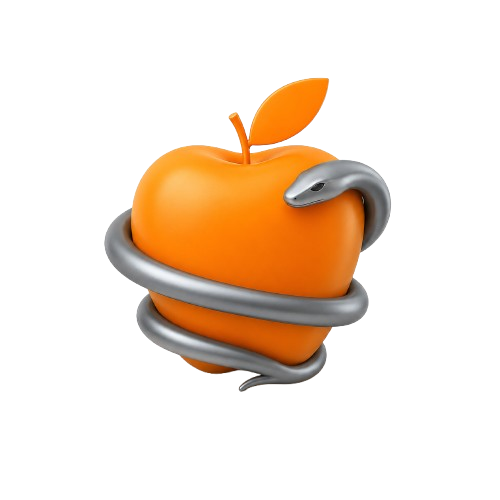

<br><br>

# 🍎 EVA
### Declarative Configuration Language

EVA is a human-readable declarative configuration language focused on simplicity, composition and readability.

It was designed to provide a cleaner and more expressive alternative for application configuration, while remaining easy to parse, write and maintain.

```eva
@project
name: "project name"
description: "that is an awesome project"
version: "3.20"

@author
name: "Jane Doe"
contact: {
    phone: "00 999 000000"
    email: "xxx@xxx.com"
}
````

# How does EVA work?

Like TOML, YAML and other declarative languages such as TOON, EVA is designed to store structured data that can later be read and processed by applications.

However, while languages like TOON focus on token optimization and TOML focuses on readability and simplicity, EVA aims to provide both a clean configuration format and lightweight runtime data interpretation.

This allows applications to dynamically resolve values, execute utility functions and compose data during initialization, making configuration management more practical and expressive for developers.

## What do I mean by practicality?

EVA provides built-in utility functions that simplify common configuration tasks.

For example:

```eva
@paths
home: env("HOME")
```

In this example, EVA resolves the user's `HOME` environment variable and stores the result inside `home` when the application starts.

EVA also includes many other utility functions and data composition features.
| Function | Description | Example |
|---|---|---|
| `absolute()` | Returns the absolute version of a path | `absolute("./config")` |
| `basename()` | Returns the file name from a path | `basename("/home/file.txt")` |
| `clamp()` | Restricts a number between a minimum and maximum value | `clamp(volume, 0, 100)` |
| `coalesce()` | Returns the first non-null value | `coalesce(a, b, c)` |
| `contains()` | Checks whether a string, array or map contains a value | `contains(items, "apple")` |
| `debug()` | Prints or exposes internal debug information | `debug(config)` |
| `deepmerge()` | Recursively merges maps | `deepmerge(base, user)` |
| `else()` | Returns a fallback value if the first value is null | `else(port, 8080)` |
| `endswith()` | Checks whether a string ends with a value | `endswith(name, ".png")` |
| `entries()` | Returns all key-value pairs from a map | `entries(user)` |
| `env()` | Reads environment variables | `env("HOME")` |
| `extname()` | Returns the extension of a file | `extname("image.png")` |
| `format()` | Formats a string using placeholders | `format("Hello {}", name)` |
| `if()` | Returns one of two values based on a condition | `if(debug, "yes", "no")` |
| `important()` | Marks a value or section as important | `important(token)` |
| `keys()` | Returns all keys from a map | `keys(config)` |
| `lower()` | Converts text to lowercase | `lower(name)` |
| `merge()` | Merges maps shallowly | `merge(a, b)` |
| `ref()` | References local values inside the current namespace | `ref(home)` |
| `startswith()` | Checks whether a string starts with a value | `startswith(path, "/home")` |
| `trim()` | Removes leading and trailing whitespace | `trim(input)` |
| `upper()` | Converts text to uppercase | `upper(name)` |
| `values()` | Returns all values from a map | `values(config)` |

## Language Support

EVA already provides functional native implementations for both C and C++.

The project is focused on portability, simplicity and predictable behavior across different environments while keeping the parser and runtime lightweight and easy to integrate.

| Language   | Support          |
| ---------- | ---------------- |
| C          | Official support |
| C++        | Official support |
| [Typescript (Bun)](https://github.com/Carla-Corp/eva-ts) | Official support |
| [Java](https://github.com/guigui-will/Eva-java) | Community support |
| [Python](https://github.com/guigui-will/Eva-py) | Community support |

Additional implementations and bindings may be added in the future as the ecosystem evolves.

The community is also welcome to create unofficial bindings for other languages and runtimes.

---

## Reading an `.eva` file in C

```c
#include <stddef.h>
#include <stdio.h>

#include "eva.h"

int main() {
    EvaParser *parser = eva_make("config.eva");
    EvaValue project_name = eva_get(parser, "project", "name");

    if( project_name.tag == eva_string ) {
        printf("Runnning %s project\n", project_name.data.string);
    }

    char *name;
    EvaValue dev_name = eva_get(parser, "dev", "name");
    if( dev_name.tag == eva_string ) {
        name = dev_name.data.string;
        printf("created by: %s\n", name);
    }

    EvaValue dev_messages = eva_get(parser, "dev", "messages");
    if( dev_messages.tag == eva_list ) {
        int index = 0;
        printf("%s said: %s\n", name, eva_listget(dev_messages, index).data.string);
    }

    return 0;
}
```

---

## Reading an `.eva` file in C++

```cpp
#include <stddef.h>
#include <iostream>
#include <stdlib.h>
#include <string>

#include "eva.hpp"

int main() {
    eva parser("config.eva");

    {   auto [exist, project_name] = parser.get<std::string>("project", "name");
        if(! exist ) return 1;
        std::cout << "Running " << project_name << " project" << std::endl;
    }

    auto [exist, name] = parser.get<std::string>("dev", "name");
    if(! exist ) return 1;
    std::cout << "created by: " << name << std::endl;

    {   auto [exist, dev_messages] = parser.get<eva::list>("dev", "messages");
        if(! exist ) return 1;

        int index = 0;
        std::cout << name << " said: " << eva::data(dev_messages.operator[]<std::string>(index)) << std::endl;
    }

    return 0;
}
```

## Reading an `.eva` file in Typescript (Bun)

```typescript
import { Eva, EvaMap, EvaList } from "eva-dcl";
import { join } from "path";

const author = new Eva(join(__dirname, "config.eva"));
const project_name = await author.get<string>("project", "name");
console.log(`Running ${project_name} project`);

const dev = await author.get<EvaMap>("dev", "name");
console.log(`created by ${dev}`);

const dev_messages = await author.get<EvaList>("dev", "messages");
const index = 0;
const message = await dev_messages.get(index);
console.log(`${dev} said: ${message}`);
```

Example `config.eva`:

```eva
@project
name: "EVA"
version: "1.0.0"

@dev
name: "Lucas Silveira"
messages: [
    format("Hello, I am {}!", ref(name)),
    "Hello, world"
]
```


